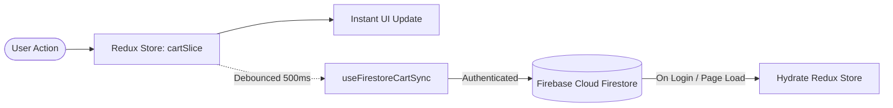

# 🍔 FoodieHub — Modern Food Ordering Web Application

[](https://foodiehub-app.vercel.app)
[](https://react.dev/)
[](https://vitejs.dev/)
[](https://redux-toolkit.js.org/)
[](https://tailwindcss.com/)
[](https://firebase.google.com/)
[](https://vitest.dev/)

> A feature-packed, production-ready food delivery web application built with **React 19**, **Vite**, **Redux Toolkit**, **Tailwind CSS v4**, and **Firebase**. Inspired by Swiggy's industry-leading user experience, FoodieHub delivers lightning-fast menu browsing, responsive cart management, cross-device Firestore cart synchronization, and dynamic code splitting.

---

## 🚀 Live Demo

🔗 **[Experience FoodieHub Live on Vercel](https://foodiehub-app.vercel.app)**  
*(Replace with your deployed Vercel URL once deployed)*

---

## 📖 Table of Contents

- [The Story & Data Architecture](#-the-story--data-architecture)
- [Key Features](#-key-features)
- [Tech Stack](#-tech-stack)
- [System Architecture & Folder Structure](#-system-architecture--folder-structure)
- [Core Engineering Concepts](#-core-engineering-concepts)
- [Firebase Cloud Synchronization](#-firebase-cloud-synchronization)
- [Getting Started & Local Setup](#-getting-started--local-setup)
- [Running Tests](#-running-tests)
- [Building & Deploying to Vercel](#-building--deploying-to-vercel)
- [Author & Acknowledgments](#-author--acknowledgments)

---

## 💡 The Story & Data Architecture

In its initial architecture, **FoodieHub** consumed real-time data directly from **Swiggy's live public APIs** (proxied via CORS bypass utilities). This enabled live restaurant listings, real-time menus, and dynamic pricing.

However, when Swiggy implemented strict API lockdowns and CORS restrictions for external consumers, access to their live endpoints became unreliable.

Rather than compromising on feature completeness or app realism, the project evolved:
- **Custom High-Fidelity Dataset**: Reverse-engineered and structured Swiggy's exact nested data contracts into rich, local JSON datasets (`mockdata.json` and `resdetails.json`).
- **Complete Payload Emulation**: Retained all original data structures — including carousel cards, grid elements, restaurant metadata, item category accordions, dietary badges (Veg/Non-Veg), ratings, and Cloudinary image asset IDs.
- **Zero Downtime & Instant Loading**: Decoupled from third-party API rate limits while keeping the exact data structures and custom hook abstraction (`useRestaurantMenu`) intact for trivial re-connection to any backend service.

---

## ✨ Key Features

- **⚡ Blazing Fast Performance**: Powered by Vite 7 with near-instant Hot Module Replacement (HMR).
- **🔍 Real-Time Restaurant Search**: Instant client-side search filtering by restaurant name with clear-input actions.
- **⭐ Top-Rated Filter**: One-click toggle filter showcasing restaurants with ratings above 4.5 stars.
- **🏷️ Higher-Order Component (HOC)**: Dynamically wraps restaurant cards with custom "Promoted" badges without altering base components.
- **📑 Collapsible Menu Accordions**: Interactive category accordions (Recommended, Combos, Beverages, etc.) with controlled component expansion.
- **🛒 Dynamic Cart Management**:
  - Global cart state powered by **Redux Toolkit**.
  - Increment/decrement quantities, individual item removals, and real-time total bill calculation.
  - One-click "Clear Cart" capability.
- **☁️ Cloud Cart Persistence (Firestore Sync)**:
  - Custom `useFirestoreCartSync` hook automatically syncs your active cart with **Firebase Cloud Firestore**.
  - Debounced updates (500ms) prevent unnecessary database writes.
  - Cart seamlessly persists across device logins and page reloads.
- **🔐 Firebase Authentication**:
  - Email & Password sign-up and sign-in.
  - One-click Google OAuth authentication via Firebase Auth.
  - Protected user account profile view.
- **🌐 Network Status Tracking**: Custom `useOnlineStatus` hook detects internet outages and displays a graceful offline fallback UI.
- **📦 Dynamic Code Splitting & Chunking**: Heavy modules like the `Grocery` mart and `About` page are bundled separately via `React.lazy()` and `<Suspense fallback={...}>` to reduce initial bundle weight.
- **💀 Shimmer Loading UI**: Custom skeleton cards for smooth perceived performance during content loading.
- **🧪 Test Coverage**: Unit and integration test suite using **Vitest** and **React Testing Library**.

---

## 🛠️ Tech Stack

| Domain | Technology | Description |
| :--- | :--- | :--- |
| **Frontend Library** | [React 19](https://react.dev/) | Component-based UI with Hooks & Suspense |
| **Build Tool** | [Vite 7](https://vitejs.dev/) | High-speed build tooling & dev server |
| **State Management** | [Redux Toolkit](https://redux-toolkit.js.org/) & [React-Redux](https://react-redux.js.org/) | Predictable, centralized application state |
| **Routing** | [React Router DOM v7](https://reactrouter.com/) | Client-side nested & dynamic routing (`/restaurants/:resId`) |
| **Styling** | [Tailwind CSS v4](https://tailwindcss.com/) | Modern utility-first responsive CSS styling |
| **Backend as a Service** | [Firebase v12](https://firebase.google.com/) | Auth (Google & Email/Password) & Firestore NoSQL Database |
| **Testing** | [Vitest](https://vitest.dev/) & [RTL](https://testing-library.com/) | Fast unit testing with Jest DOM matchers |
| **Image CDN** | [Cloudinary (Swiggy Assets)](https://res.cloudinary.com/) | Optimized food and restaurant asset delivery |

---

## 📁 System Architecture & Folder Structure

```text
RestaurantApp/
├── public/                 # Static assets
├── src/
│   ├── __tests__/          # Vitest & React Testing Library test suites
│   │   ├── Contact.test.jsx
│   │   ├── Header.test.jsx
│   │   └── sum.test.js
│   ├── components/         # Reusable presentation & container components
│   │   ├── About.jsx       # About us page (lazy-loaded)
│   │   ├── Account.jsx     # User account details & logout
│   │   ├── Body.jsx        # Main feed with search, filters & restaurant grid
│   │   ├── Cart.jsx        # Cart view with item list & bill breakdown
│   │   ├── Contact.jsx     # Contact Us form
│   │   ├── Error.jsx       # Global route error boundary
│   │   ├── Footer.jsx      # Application footer
│   │   ├── Grocery.jsx     # Grocery store vertical (lazy-loaded)
│   │   ├── Header.jsx      # Navigation bar, auth state & cart count badge
│   │   ├── ItemList.jsx    # Dish items inside accordion with Add/Remove buttons
│   │   ├── Login.jsx       # Firebase Email/Password & Google OAuth modal
│   │   ├── RestaurantCard.jsx     # Restaurant card & HOC withPromtedLabel
│   │   ├── RestaurantCategory.jsx # Controlled accordion header & panel
│   │   ├── RestaurantMenu.jsx     # Restaurant detail header & categorized menu
│   │   ├── Shimmer.jsx     # Skeleton placeholder loader
│   │   └── UserClass.jsx   # Class-based component demonstrating lifecycle methods
│   ├── utils/              # State slices, custom hooks, and mock datasets
│   │   ├── appStore.js     # Redux Toolkit store configuration
│   │   ├── cartSlice.js    # Redux cart reducer & action creators
│   │   ├── constants.js    # CDN image URLs, API endpoints & asset links
│   │   ├── firebase.js     # Firebase App, Auth & Firestore initialization
│   │   ├── mockdata.json   # Structured Swiggy restaurant feed dataset
│   │   ├── resdetails.json # Comprehensive restaurant menu items dataset
│   │   ├── useFirestoreCartSync.js # Reactive Firestore cart synchronizer
│   │   ├── useOnlineStatus.js      # Network connectivity hook
│   │   ├── useRestaurantMenu.js    # Custom data-fetching hook for restaurant menus
│   │   └── UserContext.js  # React Context for user sessions
│   ├── App.jsx             # Root layout with Header, Outlet, and Footer
│   ├── index.css           # Tailwind CSS directives & global styling
│   ├── main.jsx            # React 19 root mount & router provider
│   └── setupTests.js       # Vitest setup & jest-dom environment
├── index.html              # HTML entry point
├── package.json            # Dependencies and scripts
├── vite.config.js          # Vite configuration with React & Tailwind plugins
└── README.md               # Project documentation
```

---

## 🧠 Core Engineering Concepts

### 1. Higher-Order Components (HOC)
Used in `RestaurantCard.jsx` via `withPromtedLabel`. It takes `RestaurantCard` as an input component and returns an enhanced component that renders an absolute-positioned badge ("Promoted") without modifying the original component's internal logic.

### 2. Custom Hooks Architecture
- **`useRestaurantMenu(resId)`**: Isolates business logic and data retrieval for a specific restaurant menu, keeping presentation components clean.
- **`useOnlineStatus()`**: Subscribes to browser `online` and `offline` events and cleans up event listeners on unmount.
- **`useFirestoreCartSync()`**: Connects Firebase Auth and Firestore with Redux, debouncing writes to limit database round-trips.

### 3. Class Component Lifecycle Demonstration
`UserClass.jsx` demonstrates React class component fundamentals (`constructor`, `super(props)`, `componentDidMount`, `componentWillUnmount`) and API consumption (`https://api.github.com/users/...`), serving as an illustrative comparison alongside modern functional hooks.

### 4. Code Splitting & Chunking
The `Grocery` vertical and `About` page are bundled as separate JS chunks using:
```jsx
const Grocery = lazy(() => import("./components/Grocery"));
const About = lazy(() => import("./components/About"));
```
This ensures users only download the code for the pages they visit, significantly reducing the initial bundle size.

---

## ☁️ Firebase Cloud Synchronization

FoodieHub implements a hybrid offline/cloud cart architecture:



1. **Instant UI Response**: Every add/remove action synchronously updates the Redux store for instantaneous visual feedback.
2. **Debounced Sync**: `useFirestoreCartSync` batches changes with a 500ms timer before committing the update to `users/{userId}` in Firestore.
3. **Cross-Device Persistence**: When a user logs in from any browser or device, their stored cart document is retrieved and hydrated into the Redux store.

---

## 💻 Getting Started & Local Setup

### Prerequisites
- **Node.js**: `v18.x` or higher installed
- **npm**: `v9.x` or higher (or `pnpm` / `yarn`)

### 1. Clone the Repository
```bash
git clone https://github.com/iambuzzz/FoodieHub.git
cd FoodieHub
```

### 2. Install Dependencies
```bash
npm install
```

### 3. Start Development Server
```bash
npm run dev
```
Open your browser and navigate to:
```text
http://localhost:5173
```

---

## 🧪 Running Tests

FoodieHub includes automated tests configured with **Vitest** and **React Testing Library**:

```bash
# Run all unit and component tests once
npm test -- --run

# Run tests in watch mode
npm test
```

---

## 🚢 Building & Deploying to Vercel

### Step 1: Create Production Build
```bash
npm run build
```
The optimized production bundle will be generated in the `dist/` directory.

### Step 2: Deploy to Vercel

#### Option A: Via Vercel Dashboard (Recommended)
1. Push your repository to GitHub:
   ```bash
   git push -u origin main
   ```
2. Go to [vercel.com](https://vercel.com) and log in.
3. Click **"Add New Project"** and import `FoodieHub`.
4. Vercel will automatically detect **Vite**:
   - **Framework Preset**: `Vite`
   - **Build Command**: `npm run build`
   - **Output Directory**: `dist`
5. Click **"Deploy"**.

#### Option B: Via Vercel CLI
```bash
npx vercel
```
Follow the interactive CLI prompts to link and deploy the project.

---

## 👨‍💻 Author

**iambuzzz**
- GitHub: [@iambuzzz](https://github.com/iambuzzz)
- Repository: [https://github.com/iambuzzz/FoodieHub](https://github.com/iambuzzz/FoodieHub)

---

## 📄 License

This project is licensed under the [MIT License](LICENSE) - feel free to use it for educational and portfolio purposes!
